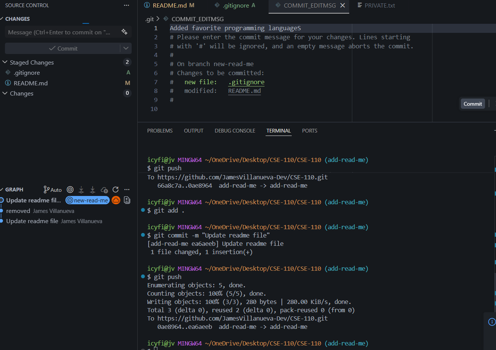

# heading

# smaller

# smallest

**some bold text**

_italics_

> Here is a quote

`System.out.println("Why is this print so long")`

Here is [github](https://pages.github.com/)

Link to header: [header](#heading)

[The readme](README.md)

-thing 1
-thing 2
-thing 3

1. thing 1
2. thing 2
3. thing 3

first
- second
  -third

- [x] finished doing lab 1
- [] finished lab 2